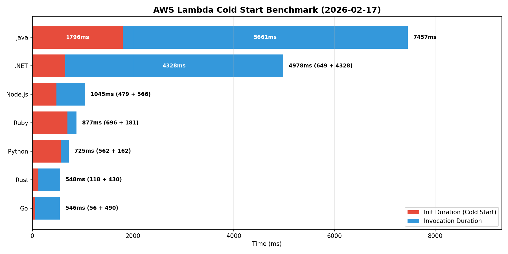

# AWS Lambda Runtime Benchmark
[日本語](README_JP.md)

A benchmark project comparing the performance (especially cold starts) of various AWS Lambda runtimes.

All runtimes execute the same workload (writing to DynamoDB) under identical conditions: ARM64 architecture with 256MB of memory, measuring response times.

## Architecture

```
Client → API Gateway → Lambda (each runtime) → DynamoDB
```

## Target Runtimes

| Language | Version | SAM Runtime |
|----------|---------|-------------|
| Python | 3.14 | python3.14 |
| Node.js | 24.x | nodejs24.x |
| Ruby | 3.4 | ruby3.4 |
| Java | 25 | java25 |
| .NET | 10 | dotnet10 |
| Go | 1.26 | provided.al2023 |
| Rust | latest | provided.al2023 |

## Benchmark Results




*Automatically updated via CI/CD pipeline*

## Build & Deploy

Prerequisites: AWS SAM CLI, an AWS account, and an S3 bucket named `aws-lambda-runtime-benchmark`

```bash
./scripts/build.sh    # Runs sam build → sam deploy in one step
```

CI/CD is also available via GitHub Actions (`.github/workflows/deploy.yaml`).

## Test

```bash
./scripts/test.sh     # Sends curl requests to all runtimes and measures response times
```
