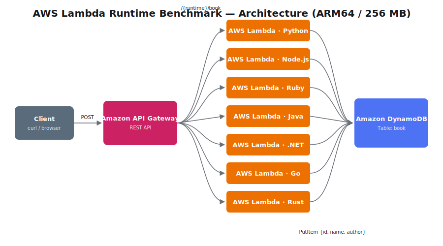
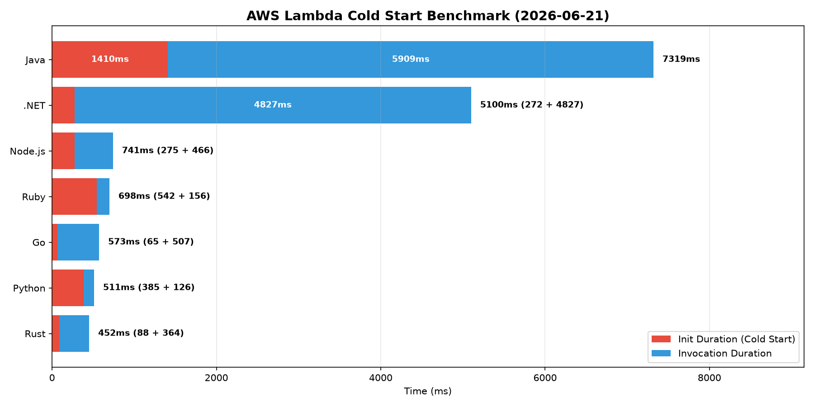
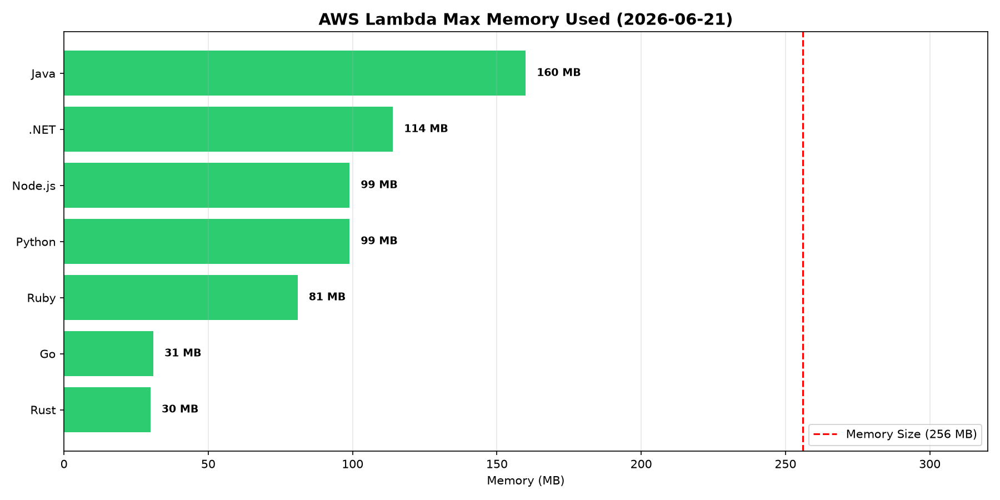

# AWS Lambda Runtime Benchmark
[日本語](README_JP.md)

A benchmark project comparing the performance (especially cold starts) of various AWS Lambda runtimes.

All runtimes execute the same workload (writing to DynamoDB) under identical conditions: ARM64 architecture with 256MB of memory, measuring response times.

## Architecture



```
Client → API Gateway → Lambda (each runtime) → DynamoDB
```

## Target Runtimes

| Language | Version | SAM Runtime |
|----------|---------|-------------|
| Python | 3.14 | python3.14 |
| Node.js | 24.x | nodejs24.x |
| Ruby | 4.0 | ruby4.0 |
| Java | 25 | java25 |
| .NET | 10 | dotnet10 |
| Go | 1.26 | provided.al2023 |
| Rust | 1.96.0 | provided.al2023 |

## A Fair Controlled Experiment

The implementations differ per language, but the *experimental conditions* are held
identical so that the measured difference reflects the runtime — not the test setup:

- **Identical conditions** for every function: ARM64 (Graviton), 256 MB, 15 s timeout,
  X-Ray active tracing, and the same workload (one DynamoDB `PutItem`).
- **Cold-start initialization is measured fairly**: the DynamoDB client is initialized
  in module/global scope (outside the handler) in *all* runtimes, so connection and SDK
  setup costs land in `Init Duration`.
- **No hard-coded configuration**: the table name is injected uniformly via the
  `TABLE_NAME` environment variable from a single source (`!Ref BooksTable`).
- **Consistent contract**: every function accepts `{name, author}`, generates the `id`
  with a UUID, and returns a `201` JSON response.
- **JIT note**: Java and .NET run on the standard JVM/CLR (no GraalVM/AOT), so they pay a
  JIT warm-up cost on the cold invocation — this is intentionally part of what is compared.

## Benchmark Results




*Automatically updated via CI/CD pipeline*

## Build & Deploy

Prerequisites: AWS SAM CLI, an AWS account, and an S3 bucket named `aws-lambda-runtime-benchmark`

```bash
./scripts/build.sh    # Runs sam build → sam deploy in one step
```

CI/CD is also available via GitHub Actions (`.github/workflows/deploy.yaml`).

## Test

```bash
./scripts/test.sh     # Sends curl requests to all runtimes and measures response times
```
